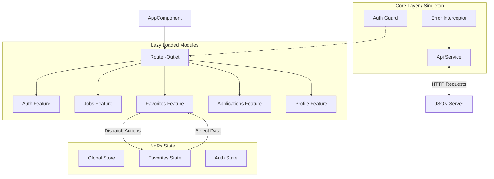

# Architecture Overview

## Component Hierarchy & Data Flow

## Data Flow Strategy
1. **Components** dispatch Actions to the Store.
2. **Effects** listen for Actions, perform side effects (API calls via Services), and dispatch Success/Failure actions.
3. **Reducers** listen for Success/Failure actions and update the State.
4. **Selectors** query the State and return Observables to Components.
